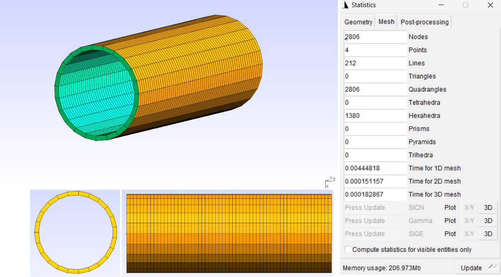

---
jupytext:
  formats: md:myst,ipynb
  text_representation:
    extension: .md
    format_name: myst
    format_version: 0.13
    jupytext_version: 1.17.0
kernelspec:
  display_name: Python 3 (ipykernel)
  language: python
  name: python3
---

+++ {"user_expressions": []}

# Soft Magnet Hollow Cylinder Enclosure

+++

This code demonstrates demagnetization calculations using the Magpylib library,
with a focus on modeling a soft magnetic hollow cylindrical enclosure.

Currently, the library does not provide native support for cylindrical
enclosures. To overcome this limitation, this example highlights the use of the
mesh import functionality to represent and simulate complex geometries with
custom meshes generated from external CAD software. These custom meshes enable
the approximation of the cylindrical geometry.

The study evaluates how different mesh structures influence the demagnetization
results. Custom meshes are imported in `.msh` and `.inp` formats and are
restricted to cuboid (hexahedral) elements, allowing direct translation into
Magpylib-compatible cuboids.

The computed magnetic fields from this meshing are compared to baseline Magpylib
results without demagnetization and FEMM simulation, enabling an assessment of
accuracy and consistency across mesh generation methods.



+++ {"user_expressions": []}

## Define magnetic sources with their susceptibilities - Custom Mesh

```{code-cell} ipython3
# soft magnet - mesh import
cyl_enclosure_meshed = import_mesh("hollow_cyl_enclosure_mm.inp",scaling=1e-3, polarization=(0,0,0), succeptibility=100)
cyl_enclosure_meshed.style.label = f"Soft hollow cylinder magnet, susceptibility=100"

# hard magnet - default mesh
cyl_magnet = magpy.magnet.Cylinder(
   polarization=(0, 0, 1.22),
   dimension=(0.025, 0.01),
   position=(0, 0, 0),
)
cyl_magnet.susceptibility = 0.05
cyl_magnet.rotate_from_rotvec((90,0,0), degrees=True)
cyl_magnet.rotate_from_rotvec((0,0,0), degrees=True)
cyl_magnet.rotate_from_rotvec((0,0,180), degrees=True)
cyl_magnet.style.label = f"Hard cylinder magnet, susceptibility=0.5"
cyl_magnet_meshed = mesh_all(
    cyl_magnet, target_elems=64, per_child_elems=False, style_label="Hard cylinder magnet, susceptibility=0.5"
)

# add sensors
ys = np.linspace(0, 0.1, 1001)
sensors = [
    magpy.Sensor(
        position=(-0.01845, y, 0),
        style_label=f"Sensor, y={y:.5f} m",
    )
    for y in ys
]

# collection of all cells
coll_meshed = magpy.Collection(*cyl_enclosure_meshed, *cyl_magnet_meshed, *sensors,override_parent=True)
coll_meshed.style.label = f"No demag"
magpy.show(coll_meshed)
```

+++ {"user_expressions": []}

## Compute material response - demagnetization - Custom Mesh

```{code-cell} ipython3
# apply demagnetization
colls = [coll_meshed]
coll_meshed_demag = apply_demag(
            coll_meshed,
            style={"label": f"Coll_demag All objects ({len(coll_meshed.sources_all):3d} cells)"},
        )
colls.append(coll_meshed_demag)
```

## Compare with FEM analysis

```{code-cell} ipython3
# compute field before demag
B_no_demag_df = magpy.getB(coll_meshed, sensors, output="dataframe")
B_cols = ["Bx", "By"]

def get_magpylib_dataframe(collection, sensors):
    df = magpy.getB(collection, sensors, output="dataframe")
    df["computation"] = collection.style.label
    return df


from magpylib_material_response import get_dataset

sim_FEMM = pd.read_csv("femm_data.csv")
sim_FEMM["computation"] = "FEMM"

df = pd.concat(
    [
        sim_FEMM,
        *[get_magpylib_dataframe(c, sensors) for c in colls],
    ]
).sort_values(["computation", "path"])


df["Distance [m]"] = np.tile(ys, colls.__len__()+1)
df["Distance [m]"] -= df["Distance [m]"].min()
```

```{code-cell} ipython3
px_kwargs = dict(
    x="Distance [m]",
    y=B_cols,
    facet_row="variable",
    color="computation",
    line_dash="computation",
    height=600,
    facet_col_spacing=0.05,
    labels={**{Bk: f"{Bk} [T]" for Bk in B_cols}, "value": "value [T]"},
)
fig1 = px.line(
    df,
    title="Methods comparison",
    **px_kwargs,
)
fig1.update_yaxes(matches=None, showticklabels=True)

display(fig1)
```

+++ {"user_expressions": []}

As shown above, the demagnetized collection outputs approach the reference FEM
values. Notably, the custom mesh provides accurate results with demagnatization
effects included.
